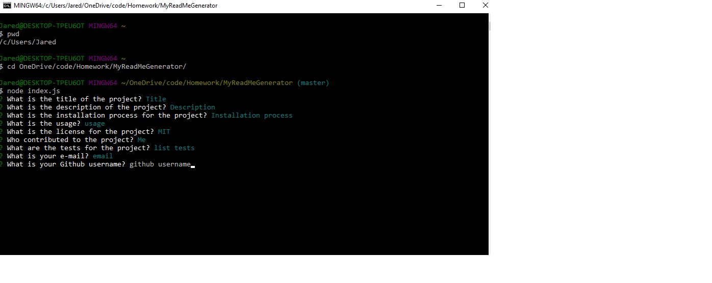

# My ReadMe Generator

## Table of Contents

_[Description](#Description)
_[Installation](#Installation)
_[Usage](#Usage)
_[License](#License)
_[Contributing](#Contributing)
_[Tests](#Tests) \*[Questions](#Questions)

## Description:

    This is a project to help people create ReadMe files fast. Just fill in the information and you will have a ReadMe generated.

## Installation:

    Clone from Git.

## Usage:

    Run node index.js and fill in the prompts.

## License:

    MIT

## Contributing:

    Jared Bartynski

## Tests:

    None

## Questions:

    If you have any questions about the repo, open an issue or contact me at Jared117@live.com. You can find more of my work at [GitHub](http://github.com)JaredBartynski.

Link to Video: https://drive.google.com/file/d/1CKvXL1U9VRMZS-WEogXekyRSgvqxfpm0/view

